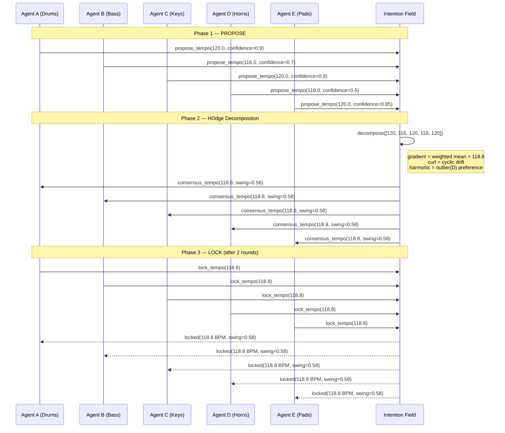
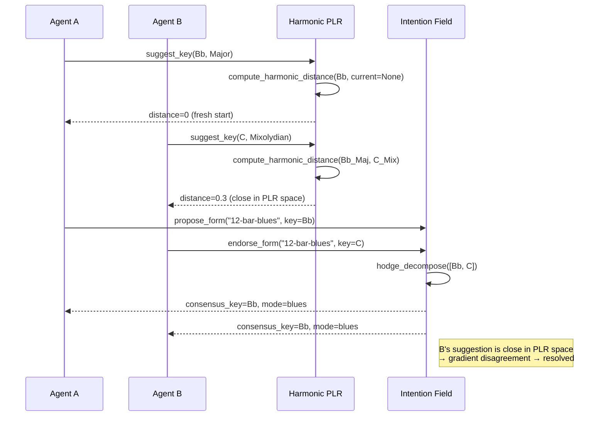
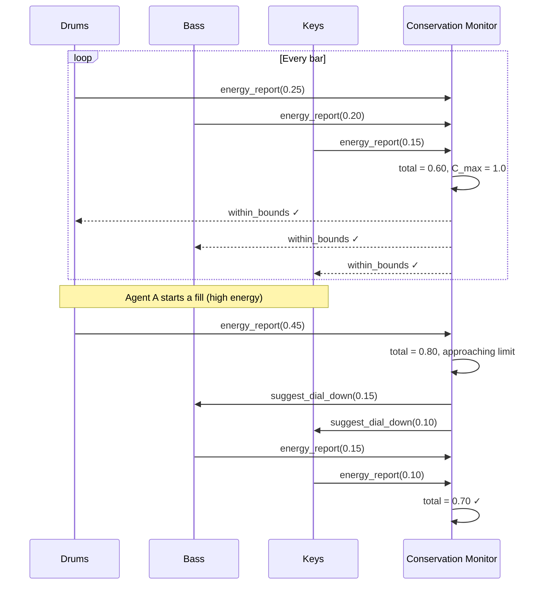
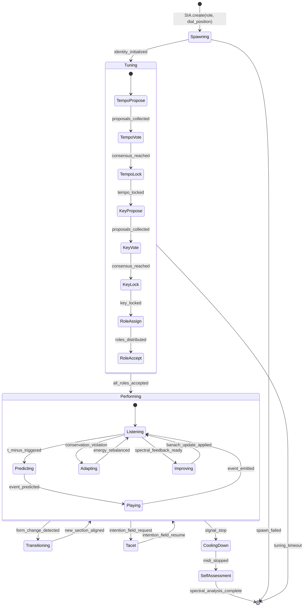
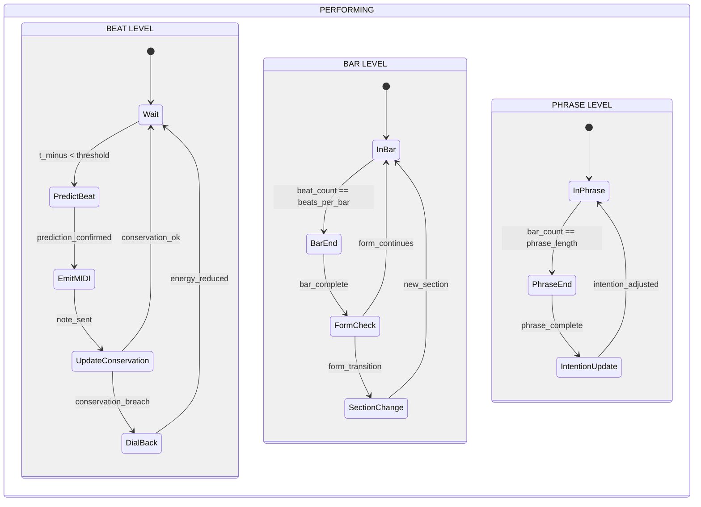
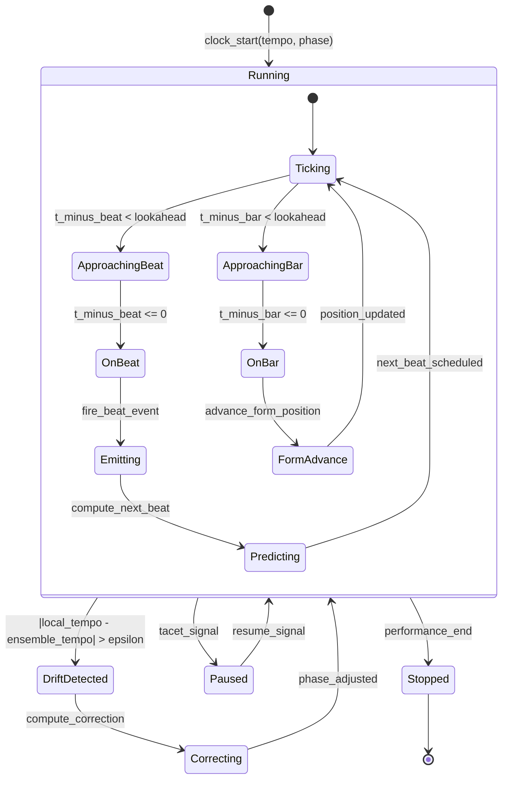

# Self-Improving Band — Architecture Reference

> *The definitive technical reference for the Self-Improving Band: autonomous AI agents that self-align, self-improve, and swing.*

---

## Table of Contents

1. [Overview](#overview)
2. [Sequence Diagrams — Tempo Negotiation](#sequence-diagrams--tempo-negotiation)
3. [State Machine — Agent Lifecycle](#state-machine--agent-lifecycle)
4. [Data Flow — MIDI ↔ Tensor Mapping](#data-flow--midi--tensor-mapping)
5. [Crate API Reference](#crate-api-reference)
6. [Turing-tensor-midi Integration Guide](#turing-tensor-midi-integration-guide)
7. [Configuration Reference](#configuration-reference)
8. [Design Principles](#design-principles)

---

## Overview

The Self-Improving Band is a distributed system of autonomous AI agents that produce music collectively. Each agent is an independent process with its own clock, model, and state. Coordination emerges from mathematical constraints — not from a central conductor.

**7 layers, 10 crates, 0 conductors.**

| Layer | Responsibility | Crates |
|-------|---------------|--------|
| Identity | Who am I? | `band-agent` |
| Clock | When do I play? | `band-tminus` |
| Language | What do I play? | `harmonic-plr`, `tropical-harmony` |
| Rhythm | How do I fit? | `conservation-rhythm` |
| Communication | How do we listen? | `band-midi`, `band-protocol` |
| Self-improvement | How do we get better? | `hodge-music`, `intention-field` |
| Ensemble | How do we perform? | `band-ensemble` |

---

## Sequence Diagrams — Tempo Negotiation

### Tempo Discovery Protocol

Agents discover tempo through a three-phase protocol: **Propose → Vote → Lock**.



### Key/Form Negotiation



### Conservation Law Enforcement During Performance



---

## State Machine — Agent Lifecycle

### Main Agent State Machine



### Agent Internal States (Detailed)



### t-minus Clock State



---

## Data Flow — MIDI ↔ Tensor Mapping

### Overview

The system maps between two representations:
- **MIDI domain**: discrete note events (pitch, velocity, duration, channel, timestamp)
- **Tensor domain**: continuous spectral state (eigenvalues, conservation vectors, PLR coefficients)

```mermaid
flowchart LR
    subgraph "MIDI Domain"
        ME[MIDI Event<br/>note_on/note_off<br/>cc/pc]
        MB[MIDI Buffer<br/>quantized events<br/>with t-minus timestamps]
    end
    
    subgraph "Mapping Layer"
        E2T[MIDI → Tensor<br/>encode()]
        T2E[Tensor → MIDI<br/>decode()]
        TC[Tensor Cache<br/>sliding window]
    end
    
    subgraph "Tensor Domain"
        SS[Spectral State<br/>eigenvalues λ₁..λₙ]
        CV[Conservation Vector<br/>γ, H, C]
        HC[Harmonic Coefficients<br/>PLR group elements]
        IF[Intention Field<br/>potential φ(x,t)]
    end
    
    ME --> E2T
    E2T --> SS
    E2T --> CV
    E2T --> HC
    SS --> T2E
    CV --> T2E
    HC --> T2E
    T2E --> MB
    TC -.-> E2T
    TC -.-> T2E
```

### MIDI → Tensor Encoding

Each MIDI event is encoded into a tensor representation:

```
Input: MIDI Event
  - type: note_on | note_off | cc | pc
  - channel: 0-15
  - data: [pitch, velocity, duration]
  - timestamp: t_minus tick

Encoding Pipeline:
  1. Pitch → Harmonic Vector
     - Map MIDI pitch to PLR group element
     - Compute tropical distance from current tonal center
     - Result: k-dimensional harmonic vector
     
  2. Velocity → Energy Scalar
     - velocity / 127 → normalized energy [0, 1]
     - Contributes to agent's γ (kinetic term)
     - Running average maintains conservation budget
     
  3. Duration → Temporal Tensor
     - Map to beat/bar/phrase grid
     - Compute phase offset from grid alignment
     - Result: 3D temporal tensor [bar, beat, phase]
     
  4. Timestamp → t-minus Vector
     - Compute delta from predicted event time
     - Swing/groove offset extraction
     - Result: timing deviation vector
     
Output: Agent Tensor State
  - harmonic: Vec<f64>      // PLR coefficients
  - energy: f64             // kinetic energy γ
  - temporal: [f64; 3]      // [bar_phase, beat_phase, swing]
  - timing_deviation: f64   // t-minus prediction error
```

### Tensor → MIDI Decoding

The reverse: converting spectral decisions back into performable MIDI:

```
Input: Agent Tensor State
  - harmonic: PLR coefficient vector
  - energy: scalar γ
  - temporal: phase tensor
  - intention: field gradient

Decoding Pipeline:
  1. Harmonic Vector → Pitch Selection
     - Project PLR coefficients onto tonal grid
     - Select pitch nearest to harmonic target
     - Apply microtonal offset from tropical distance
     
  2. Energy Scalar → Velocity
     - Map γ to velocity range [0, 127]
     - Apply dynamic curve (compress/expand)
     - Conservation check: is velocity within energy budget?
     
  3. Temporal Tensor → Duration + Position
     - Compute grid position from [bar, beat, phase]
     - Apply swing offset: duration * (1 + swing_factor)
     - Quantize to nearest t-minus tick
     
  4. Intention Gradient → Expression
     - Map ∇φ to continuous controller values
     - CC1 (modulation): timbral change
     - CC7 (volume): dynamic contour
     - CC64 (sustain): phrase shaping
     
Output: MIDI Event
  - type, channel, [pitch, velocity, duration]
  - t_minus scheduled time
```

### Batch Tensor Flow (Ensemble-Level)

```
┌─────────────────────────────────────────────────────────┐
│                    ENSEMBLE TENSOR                       │
│                                                          │
│  Agent A ──┐                                             │
│  Agent B ──┤──→ Concat ──→ Spectral Decomposition ──┐    │
│  Agent C ──┤         (n × d tensor)     (eigen)      │    │
│  Agent D ──┤                                         │    │
│  Agent E ──┘                                         │    │
│                                                      ▼    │
│                                              Improvement   │
│                                              Dynamics      │
│                                                      │    │
│                                                      ▼    │
│  ┌──────────────────────────────────────────────────────┐  │
│  │ Per-Agent Update (Banach-convergent)                 │  │
│  │  Agent A: Δspectral_A = f(λ_A, bottleneck)          │  │
│  │  Agent B: Δspectral_B = f(λ_B, bottleneck)          │  │
│  │  ...                                                 │  │
│  │  Conservation check: Σ(γ_i + H_i) = C_total         │  │
│  └──────────────────────────────────────────────────────┘  │
│                          │                                 │
│                          ▼                                 │
│              Tensor → MIDI decode per agent                │
│                          │                                 │
│              ┌───────┬───┴───┬───────┬───────┐            │
│              ▼       ▼       ▼       ▼       ▼            │
│           [MIDI_A] [MIDI_B] [MIDI_C] [MIDI_D] [MIDI_E]   │
└─────────────────────────────────────────────────────────┘
```

---

## Crate API Reference

### 1. `band-protocol`

Wire protocol for inter-agent communication. Defines the message format that flows between all band members.

```rust
/// Core protocol types shared by all band crates.
pub mod protocol {
    /// Unique agent identifier within an ensemble.
    #[derive(Clone, Copy, Debug, Hash, Eq, PartialEq)]
    pub struct AgentId(pub u32);
    
    /// Musical timestamp using t-minus countdown, not wall clock.
    #[derive(Clone, Copy, Debug)]
    pub struct TMinusTimestamp {
        /// Seconds until this event should fire.
        pub countdown: f64,
        /// Session-local monotonic counter for causal ordering.
        pub tick: u64,
        /// Agent's local phase position [0, 1).
        pub phase: f64,
    }
    
    /// A single MIDI event with band metadata.
    #[derive(Clone, Debug)]
    pub struct BandMidiEvent {
        pub agent_id: AgentId,
        pub timestamp: TMinusTimestamp,
        pub midi: MidiMessage,
        /// Conservation energy cost of this event.
        pub energy_cost: f64,
        /// Provenance: why this event was generated.
        pub provenance: ProvenanceTag,
    }
    
    /// MIDI message types.
    #[derive(Clone, Debug)]
    pub enum MidiMessage {
        NoteOn { channel: u8, pitch: u8, velocity: u8 },
        NoteOff { channel: u8, pitch: u8 },
        ControlChange { channel: u8, cc: u8, value: u8 },
        ProgramChange { channel: u8, program: u8 },
        PitchBend { channel: u8, value: u16 },
    }
    
    /// Why an event was generated (provenance chain).
    #[derive(Clone, Debug)]
    pub enum ProvenanceTag {
        /// Agent's own musical decision.
        Autonomous,
        /// Response to another agent's event.
        Reactive { trigger: AgentId },
        /// Conservation law rebalancing.
        ConservationAdjustment,
        /// Intention field gradient following.
        IntentionDriven { field_version: u64 },
        /// Self-improvement feedback.
        SpectralUpdate { eigenvalue_index: usize },
    }
    
    /// Band-level message envelope.
    #[derive(Clone, Debug)]
    pub enum BandMessage {
        /// Musical event.
        Event(BandMidiEvent),
        /// Tempo proposal during negotiation.
        TempoProposal { bpm: f64, confidence: f64 },
        /// Key/form proposal.
        FormProposal { key: Key, form: FormSpec },
        /// Conservation status report.
        ConservationReport { energy: f64, budget: f64 },
        /// Spectral state for self-improvement.
        SpectralState { eigenvalues: Vec<f64> },
        /// Intention field update.
        IntentionUpdate { gradient: Vec<f64>, potential: f64 },
        /// Agent lifecycle.
        AgentReady,
        AgentTacet { bars_remaining: u32 },
        AgentStop,
    }
    
    /// Musical key specification.
    #[derive(Clone, Debug)]
    pub struct Key {
        pub tonic: u8,       // MIDI pitch class 0-11
        pub mode: Mode,
    }
    
    #[derive(Clone, Debug)]
    pub enum Mode {
        Major, Minor, Mixolydian, Dorian, Blues,
        // Extensible via PLR group operations
    }
    
    /// Form specification (e.g., 12-bar blues, AABA).
    #[derive(Clone, Debug)]
    pub struct FormSpec {
        pub name: String,
        pub sections: Vec<FormSection>,
        pub total_bars: u32,
    }
    
    #[derive(Clone, Debug)]
    pub struct FormSection {
        pub label: char,           // 'A', 'B', etc.
        pub bars: u32,
        pub repeats: u32,
    }
}

/// Transport-agnostic message bus trait.
pub trait BandBus: Send + Sync {
    fn broadcast(&self, msg: BandMessage) -> Result<(), BandError>;
    fn send_to(&self, target: AgentId, msg: BandMessage) -> Result<(), BandError>;
    fn receive(&self, agent: AgentId) -> Result<Vec<BandMessage>, BandError>;
}

/// Error type for protocol operations.
#[derive(Debug)]
pub enum BandError {
    TransportError(String),
    SerializationError(String),
    AgentNotFound(AgentId),
    ConservationViolation { agent: AgentId, energy: f64, budget: f64 },
}
```

**Dependencies**: `serde`, `tokio` (for async bus implementations)

---

### 2. `band-agent`

Individual agent — SIA instance with spectral identity, conservation envelope, and improvement trajectory.

```rust
pub mod agent {
    use band_protocol::*;
    
    /// Configuration for creating a new band agent.
    #[derive(Debug)]
    pub struct AgentConfig {
        pub id: AgentId,
        pub role: AgentRole,
        pub dial_position: DialVector,
        pub midi_channel: u8,
        pub energy_budget: f64,
    }
    
    /// Musical role within the ensemble.
    #[derive(Clone, Debug)]
    pub enum AgentRole {
        Drums,
        Bass,
        Keys,
        Horns,
        Pads,
        Guitar,
        Custom { name: String, register: Register },
    }
    
    #[derive(Clone, Debug)]
    pub enum Register {
        Low,    // Bass, kick, low pads
        Mid,    // Keys, guitar, mids
        High,   // Horns, hi-hat, highs
        Full,   // Full range
    }
    
    /// Cultural/traditional dial position.
    #[derive(Clone, Debug)]
    pub struct DialVector {
        /// Traditional (0) ↔ Experimental (1)
        pub traditionality: f64,
        /// Simple (0) ↔ Complex (1)
        pub complexity: f64,
        /// Tight (0) ↔ Loose (1)
        pub groove_looseness: f64,
        /// Quiet (0) ↔ Loud (1)
        pub dynamics: f64,
    }
    
    impl Default for DialVector {
        fn default() -> Self {
            Self {
                traditionality: 0.5,
                complexity: 0.5,
                groove_looseness: 0.3,
                dynamics: 0.5,
            }
        }
    }
    
    /// Spectral identity — the agent's "timbral fingerprint."
    #[derive(Clone, Debug)]
    pub struct SpectralState {
        /// Eigenvalue decomposition of agent's performance tensor.
        pub eigenvalues: Vec<f64>,
        /// Corresponding eigenvectors (harmonic/timbral profiles).
        pub eigenvectors: Vec<Vec<f64>>,
        /// Dominant eigenmode (primary musical personality).
        pub dominant_mode: usize,
        /// Banach contraction factor (< 1 guarantees convergence).
        pub contraction_factor: f64,
    }
    
    /// Conservation envelope: γ + H = C
    #[derive(Clone, Debug)]
    pub struct ConservationEnvelope {
        /// Kinetic energy (active playing intensity).
        pub gamma: f64,
        /// Hamiltonian / potential energy (tension, preparation).
        pub hamiltonian: f64,
        /// Total conservation constant (budget).
        pub constant: f64,
        /// Maximum allowed deviation from C before correction.
        pub tolerance: f64,
    }
    
    impl ConservationEnvelope {
        pub fn new(budget: f64, tolerance: f64) -> Self {
            Self {
                gamma: budget * 0.5,
                hamiltonian: budget * 0.5,
                constant: budget,
                tolerance,
            }
        }
        
        /// Check if the agent is within its conservation bounds.
        pub fn is_conserved(&self) -> bool {
            (self.gamma + self.hamiltonian - self.constant).abs() < self.tolerance
        }
        
        /// Rebalance: shift energy between γ and H to satisfy γ + H = C.
        pub fn rebalance(&mut self) {
            let deficit = self.constant - (self.gamma + self.hamiltonian);
            if deficit.abs() > self.tolerance {
                // Split the correction equally
                self.gamma += deficit * 0.5;
                self.hamiltonian += deficit * 0.5;
            }
        }
    }
    
    /// A fully initialized band agent.
    pub struct BandAgent {
        pub config: AgentConfig,
        pub spectral_state: SpectralState,
        pub conservation: ConservationEnvelope,
        pub tminus: band_tminus::TMinusClock,
        pub harmonic_state: harmonicplr::HarmonicState,
        pub intention_gradient: Vec<f64>,
        pub status: AgentStatus,
    }
    
    #[derive(Clone, Debug, PartialEq)]
    pub enum AgentStatus {
        Spawning,
        Tuning,
        Performing,
        Transitioning,
        Tacet { bars_remaining: u32 },
        CoolingDown,
        Stopped,
    }
}
```

**Dependencies**: `band-protocol`, `band-tminus`, `harmonic-plr`, `conservation-rhythm`

---

### 3. `band-ensemble`

Manages the collection of agents, runs the performance loop, and coordinates self-improvement cycles.

```rust
pub mod ensemble {
    use band_agent::*;
    use band_protocol::*;
    use hodge_music::*;
    use intention_field::*;
    
    /// Ensemble configuration.
    #[derive(Debug)]
    pub struct EnsembleConfig {
        pub agents: Vec<AgentConfig>,
        pub default_tempo: f64,
        pub default_key: Key,
        pub default_form: FormSpec,
        pub conservation_total: f64,
        /// Maximum allowed tempo drift between agents (ms).
        pub tempo_tolerance_ms: f64,
        /// AI provider for musical decisions.
        pub ai: AiConfig,
    }
    
    /// AI provider configuration (z.ai + DeepInfra only).
    #[derive(Debug)]
    pub struct AiConfig {
        pub primary: ProviderConfig,
        pub fallback: ProviderConfig,
        pub max_tokens: u32,
        pub temperature: f64,
    }
    
    #[derive(Debug)]
    pub struct ProviderConfig {
        pub provider: String,  // "zai" or "deepinfra"
        pub model: String,     // "glm-5.1" or "Seed-2.0-mini"
        pub base_url: String,
    }
    
    /// The running ensemble.
    pub struct Ensemble {
        pub config: EnsembleConfig,
        pub agents: Vec<BandAgent>,
        pub intention_field: IntentionField,
        pub hodge_decomposer: HodgeDecomposer,
        pub bus: Box<dyn BandBus>,
        pub status: EnsembleStatus,
    }
    
    #[derive(Clone, Debug, PartialEq)]
    pub enum EnsembleStatus {
        /// Agents are spawning and negotiating.
        Tuning,
        /// All agents aligned, music is happening.
        Performing {
            current_bar: u32,
            current_section: char,
            tempo: f64,
        },
        /// Between sections.
        Transitioning {
            from: char,
            to: char,
            bars_until_lock: u32,
        },
        /// Performance ended, running spectral analysis.
        CoolingDown,
        /// Fully stopped.
        Stopped,
    }
    
    impl Ensemble {
        /// Create a new ensemble from configuration.
        pub fn new(config: EnsembleConfig, bus: Box<dyn BandBus>) -> Result<Self, EnsembleError>;
        
        /// Spawn all agents and begin tuning phase.
        pub async fn startup(&mut self) -> Result<(), EnsembleError>;
        
        /// Run the main performance loop.
        /// Each tick: advance t-minus clocks, collect events, enforce conservation.
        pub async fn perform_tick(&mut self, dt: f64) -> Result<Vec<BandMidiEvent>, EnsembleError>;
        
        /// Trigger a self-improvement cycle.
        /// Runs spectral analysis on recent performance and updates agents.
        pub async fn self_improve(&mut self) -> Result<ImprovementReport, EnsembleError>;
        
        /// Gracefully stop the ensemble.
        pub async fn shutdown(&mut self) -> Result<SpectralSummary, EnsembleError>;
    }
    
    /// Report from a self-improvement cycle.
    #[derive(Debug)]
    pub struct ImprovementReport {
        pub weakest_agent: AgentId,
        pub weakest_eigenvalue: usize,
        pub improvement_deltas: Vec<f64>,
        pub convergence_guaranteed: bool,
        pub conservation_intact: bool,
    }
    
    /// Final spectral summary after performance.
    #[derive(Debug)]
    pub struct SpectralSummary {
        pub total_bars: u32,
        pub avg_tempo: f64,
        pub max_drift_ms: f64,
        pub agent_summaries: Vec<AgentSpectralSummary>,
        pub conservation_violations: u32,
    }
    
    #[derive(Debug)]
    pub struct AgentSpectralSummary {
        pub agent_id: AgentId,
        pub eigenvalues: Vec<f64>,
        pub improvement_ratio: f64,
        pub energy_used: f64,
        pub events_generated: u64,
    }
    
    #[derive(Debug)]
    pub enum EnsembleError {
        AgentSpawnFailed(AgentId, String),
        TuningTimeout,
        ConservationViolation { agent: AgentId, excess: f64 },
        BusError(String),
        AiError(String),
    }
}
```

**Dependencies**: `band-agent`, `band-protocol`, `band-tminus`, `hodge-music`, `intention-field`, `conservation-rhythm`

---

### 4. `band-midi`

MIDI I/O, routing, and the flux bridge between agents.

```rust
pub mod midi {
    use band_protocol::*;
    
    /// MIDI routing configuration.
    #[derive(Debug)]
    pub struct MidiRouting {
        /// Which agents can hear which other agents.
        /// (source, [listeners])
        pub routes: Vec<(AgentId, Vec<AgentId>)>,
        /// Whether agents can hear themselves (feedback).
        pub self_listen: bool,
    }
    
    impl MidiRouting {
        /// Full mesh: every agent hears every other agent.
        pub fn full_mesh(agent_ids: &[AgentId]) -> Self;
        
        /// Section-based: rhythm section hears each other, horns hear rhythm.
        pub fn section_based(agents: &[AgentId], roles: &[AgentRole]) -> Self;
    }
    
    /// The MIDI flux bridge — routes events between agents.
    pub struct MidiFluxBridge {
        routing: MidiRouting,
        /// Swing factor: 0 = straight, ~0.33 = triplet swing, 0.5 = hard swing.
        swing: f64,
        /// Humanization: random timing jitter in ms.
        humanize_ms: f64,
        /// Buffer of recent events for each agent (sliding window).
        buffers: std::collections::HashMap<AgentId, Vec<TimestampedEvent>>,
    }
    
    struct TimestampedEvent {
        event: BandMidiEvent,
        wall_time: f64,
    }
    
    impl MidiFluxBridge {
        pub fn new(routing: MidiRouting) -> Self;
        
        /// Route an event from source agent to all listeners.
        /// Applies swing offset and humanization.
        pub fn route(&mut self, event: BandMidiEvent) -> Vec<BandMidiEvent>;
        
        /// Get recent events for an agent (what it "hears").
        pub fn listen(&self, agent_id: AgentId) -> &[TimestampedEvent];
        
        /// Set swing factor dynamically.
        pub fn set_swing(&mut self, swing: f64);
        
        /// Flush all buffers (end of performance).
        pub fn flush(&mut self);
    }
    
    /// Convert band events to raw MIDI bytes (for external MIDI output).
    pub fn encode_midi_bytes(event: &BandMidiEvent) -> Vec<u8>;
    
    /// Parse raw MIDI bytes into band events.
    pub fn decode_midi_bytes(bytes: &[u8], agent_id: AgentId) -> Result<BandMidiEvent, MidiError>;
    
    #[derive(Debug)]
    pub enum MidiError {
        InvalidMessage(String),
        RoutingError(String),
    }
}
```

**Dependencies**: `band-protocol`

---

### 5. `band-tminus`

t-minus event simulation — each agent's local clock.

```rust
pub mod tminus {
    use band_protocol::*;
    
    /// The t-minus clock — counts down to predicted events.
    pub struct TMinusClock {
        /// Agent that owns this clock.
        pub agent_id: AgentId,
        /// Current tempo in BPM.
        pub tempo: f64,
        /// Period of one beat in seconds.
        beat_period: f64,
        /// Current phase within the beat [0, 1).
        pub beat_phase: f64,
        /// Current phase within the bar [0, 1).
        pub bar_phase: f64,
        /// Current phase within the phrase [0, 1).
        pub phrase_phase: f64,
        /// Time signature.
        pub time_signature: TimeSignature,
        /// Swing factor applied to off-beats.
        pub swing: f64,
        /// Countdown to next beat.
        t_minus_beat: f64,
        /// Countdown to next bar.
        t_minus_bar: f64,
        /// Countdown to next phrase boundary.
        t_minus_phrase: f64,
        /// Monotonic tick counter.
        pub tick: u64,
        /// Accumulated drift from ensemble tempo (ms).
        drift_ms: f64,
    }
    
    #[derive(Clone, Debug)]
    pub struct TimeSignature {
        pub beats_per_bar: u32,
        pub beat_unit: u32,  // 4 = quarter note
    }
    
    impl Default for TimeSignature {
        fn default() -> Self {
            Self { beats_per_bar: 4, beat_unit: 4 }
        }
    }
    
    /// Events fired by the clock.
    #[derive(Clone, Debug)]
    pub enum ClockEvent {
        Beat { beat_in_bar: u32 },
        Bar { bar_in_phrase: u32 },
        Phrase { phrase_number: u32 },
        Downbeat,
        Upbeat,
    }
    
    impl TMinusClock {
        pub fn new(agent_id: AgentId, tempo: f64, time_sig: TimeSignature) -> Self;
        
        /// Advance the clock by dt seconds.
        /// Returns any clock events that fired during this tick.
        pub fn tick(&mut self, dt: f64) -> Vec<ClockEvent>;
        
        /// Get the current t-minus countdown to next beat.
        pub fn t_minus_beat(&self) -> f64;
        
        /// Get the current t-minus countdown to next bar.
        pub fn t_minus_bar(&self) -> f64;
        
        /// Adjust tempo (e.g., after ensemble negotiation).
        /// Uses smooth interpolation to avoid audible jumps.
        pub fn set_tempo(&mut self, new_tempo: f64, transition_beats: f64);
        
        /// Apply a phase correction (e.g., after drift detection).
        pub fn correct_phase(&mut self, delta_phase: f64);
        
        /// Compute swing-adjusted duration for the given beat position.
        pub fn swing_duration(&self, beat_position: f64) -> f64;
        
        /// Detect drift from a reference tempo.
        pub fn detect_drift(&self, reference_tempo: f64) -> DriftInfo;
        
        /// Current form position as a musical coordinate.
        pub fn form_position(&self) -> FormPosition;
    }
    
    #[derive(Clone, Debug)]
    pub struct DriftInfo {
        pub drift_ms: f64,
        pub drift_direction: DriftDirection,
        pub correction_needed: f64,
    }
    
    #[derive(Clone, Debug)]
    pub enum DriftDirection {
        Ahead,   // Agent is early
        Behind,  // Agent is late
        OnTime,
    }
    
    #[derive(Clone, Debug)]
    pub struct FormPosition {
        pub bar: u32,
        pub beat: u32,
        pub phase: f64,
        pub section: char,
    }
}
```

**Dependencies**: `band-protocol`

---

### 6. `harmonic-plr`

PLR group operations for harmonic navigation.

```rust
pub mod plr {
    use band_protocol::*;
    
    /// The PLR group: Parallel, Lead (Relative), Relative (Lead).
    /// These are the generators of the hexacyclic group acting on major triads.
    pub enum PLROperation {
        /// P: Parallel major ↔ minor (same root)
        Parallel,
        /// L: Lead — leading-tone exchange
        Lead,
        /// R: Relative — relative major ↔ minor
        Relative,
    }
    
    /// Agent's harmonic state within the PLR group.
    pub struct HarmonicState {
        /// Current tonal center.
        pub key: Key,
        /// Current chord (as scale degrees or pitch classes).
        pub current_chord: Chord,
        /// Available transformations from current position.
        pub available_moves: Vec<PLROperation>,
        /// Tropical distances for each available move.
        pub move_distances: Vec<f64>,
        /// History of recent harmonic moves (for PLR walk analysis).
        pub history: Vec<PLROperation>,
    }
    
    /// A chord represented as pitch classes.
    #[derive(Clone, Debug)]
    pub struct Chord {
        pub root: u8,           // Pitch class 0-11
        pub quality: ChordQuality,
        pub extensions: Vec<u8>, // 7th, 9th, etc.
    }
    
    #[derive(Clone, Debug)]
    pub enum ChordQuality {
        Major, Minor, Diminished, Augmented,
        Dominant7, Major7, Minor7,
        HalfDim, FullyDim,
    }
    
    impl HarmonicState {
        pub fn new(key: Key) -> Self;
        
        /// Apply a PLR transformation, returning the new chord.
        pub fn apply(&mut self, op: PLROperation) -> Chord;
        
        /// Compute all possible next chords via PLR operations.
        pub fn neighbors(&self) -> Vec<(PLROperation, Chord, f64)>;
        
        /// Tropical distance between two chords (harmonic "cost").
        pub fn tropical_distance(a: &Chord, b: &Chord) -> f64;
        
        /// Generate a walk through harmonic space respecting constraints.
        pub fn constrained_walk(
            &self,
            max_distance: f64,
            form: &FormSpec,
        ) -> Vec<Chord>;
    }
}
```

**Dependencies**: `band-protocol`, `tropical-harmony`

---

### 7. `tropical-harmony`

Tropical semiring operations for harmonic distance and navigation.

```rust
pub mod tropical {
    use harmonicplr::*;
    
    /// Tropical semiring: (ℝ ∪ {∞}, ⊕, ⊗)
    /// where a ⊕ b = min(a, b) and a ⊗ b = a + b
    /// Applied to harmonic distances: the "cost" of moving between chords.
    
    /// Compute tropical distance between two chords.
    /// Returns the minimum number of PLR operations (weighted).
    pub fn tropical_distance(a: &Chord, b: &Chord) -> f64;
    
    /// Tropical matrix multiplication for chord transition probabilities.
    pub fn tropical_matmul(a: &Vec<Vec<f64>>, b: &Vec<Vec<f64>>) -> Vec<Vec<f64>>;
    
    /// Find the shortest path through harmonic space between two chords.
    pub fn shortest_path(start: &Chord, end: &Chord) -> Vec<Chord>;
    
    /// Tropical polynomial: evaluates the "cost surface" at a chord.
    pub fn cost_surface(chord: &Chord, center: &Key) -> f64;
}
```

**Dependencies**: `harmonic-plr`

---

### 8. `conservation-rhythm`

Conservation law enforcement for rhythmic energy.

```rust
pub mod conservation {
    use band_protocol::*;
    
    /// Ensemble-wide conservation monitor.
    /// Enforces: Σ(γᵢ + Hᵢ) = C_total
    pub struct ConservationMonitor {
        /// Total energy budget for the ensemble.
        pub total_budget: f64,
        /// Per-agent energy state.
        pub agent_states: std::collections::HashMap<AgentId, AgentEnergy>,
        /// Tolerance before correction kicks in.
        pub tolerance: f64,
    }
    
    #[derive(Clone, Debug)]
    pub struct AgentEnergy {
        pub gamma: f64,        // Kinetic (active playing)
        pub hamiltonian: f64,  // Potential (tension/resolution)
        pub budget: f64,       // This agent's share of C_total
    }
    
    /// Conservation violation detected.
    #[derive(Debug)]
    pub struct Violation {
        pub agent: AgentId,
        pub excess: f64,
        pub direction: ViolationDirection,
        pub suggested_correction: f64,
    }
    
    #[derive(Debug)]
    pub enum ViolationDirection {
        OverActive,   // γ too high, needs to reduce activity
        UnderActive,  // γ too low, has room to play more
        Imbalanced,   // γ + H ≠ C for this agent
    }
    
    impl ConservationMonitor {
        pub fn new(total_budget: f64, agent_ids: &[AgentId]) -> Self;
        
        /// Report an energy expenditure from an agent.
        pub fn report(&mut self, agent: AgentId, energy_delta: f64);
        
        /// Check all agents for conservation violations.
        pub fn check(&self) -> Vec<Violation>;
        
        /// Compute suggested energy adjustments to bring ensemble back to conservation.
        pub fn compute_corrections(&self) -> Vec<(AgentId, f64)>;
        
        /// Rebalance all agents to satisfy conservation.
        pub fn rebalance(&mut self) -> Vec<(AgentId, f64)>;
    }
}
```

**Dependencies**: `band-protocol`

---

### 9. `hodge-music`

Hodge decomposition for separating musical disagreements into gradient, curl, and harmonic components.

```rust
pub mod hodge {
    use band_protocol::*;
    
    /// Hodge decomposition of agent disagreement vectors.
    /// Decomposes a vector field (agent preferences/states) into:
    /// - Gradient component: fixable by parameter adjustment
    /// - Curl component: cyclic disagreements, resolvable by iteration
    /// - Harmonic component: creative tension (feature, not bug)
    pub struct HodgeDecomposer {
        /// Number of agents in the ensemble.
        pub n_agents: usize,
        /// Dimension of the disagreement space.
        pub dimension: usize,
    }
    
    /// Result of decomposing ensemble disagreements.
    #[derive(Debug)]
    pub struct HodgeResult {
        /// Gradient component — fixable disagreements.
        /// Example: tempo drift → simple parameter nudge.
        pub gradient: Vec<f64>,
        /// Curl component — cyclic disagreements.
        /// Example: call-response loops that need iteration to resolve.
        pub curl: Vec<f64>,
        /// Harmonic component — irreducible creative tension.
        /// This is where the interesting music lives.
        pub harmonic: Vec<f64>,
        /// Original disagreement vector (for verification).
        pub original: Vec<f64>,
    }
    
    impl HodgeDecomposer {
        pub fn new(n_agents: usize, dimension: usize) -> Self;
        
        /// Decompose a disagreement vector field.
        /// Input: one vector per agent representing its deviation from consensus.
        pub fn decompose(&self, disagreements: &[Vec<f64>]) -> HodgeResult;
        
        /// Check if a disagreement is "cheap" to fix (mostly gradient).
        pub fn is_fixable(&self, result: &HodgeResult) -> bool;
        
        /// How much creative tension exists? (harmonic component magnitude)
        pub fn creative_tension(&self, result: &HodgeResult) -> f64;
    }
}
```

**Dependencies**: `band-protocol`

---

### 10. `intention-field`

The shared potential field that gives the ensemble collective direction.

```rust
pub mod intention {
    use band_protocol::*;
    
    /// The intention field: a shared potential φ(x, t) that guides the ensemble.
    /// Agents follow the gradient ∇φ toward musical goals.
    pub struct IntentionField {
        /// Current potential value.
        pub potential: f64,
        /// Gradient in each musical dimension.
        pub gradient: IntentionGradient,
        /// Current musical state of the field.
        pub state: FieldState,
        /// Version counter for provenance tracking.
        pub version: u64,
    }
    
    /// Musical dimensions the field operates on.
    #[derive(Clone, Debug)]
    pub struct IntentionGradient {
        pub tempo: f64,       // BPM change per bar
        pub harmony: f64,     // PLR distance per bar
        pub dynamics: f64,    // Energy shift per bar
        pub density: f64,     // Note count change per bar
        pub tension: f64,     // Harmonic tension change
    }
    
    /// Current state of the intention field.
    #[derive(Clone, Debug)]
    pub struct FieldState {
        pub key: Key,
        pub tempo: f64,
        pub form: FormSpec,
        pub form_position: u32,
        pub energy_level: f64,
        pub phase: FieldPhase,
    }
    
    #[derive(Clone, Debug, PartialEq)]
    pub enum FieldPhase {
        /// Building toward something.
        Developing,
        /// Stable groove or pattern.
        Groove,
        /// Transitioning between sections.
        Transitioning,
        /// Climax or peak intensity.
        Climax,
        /// Winding down.
        Resolution,
    }
    
    impl IntentionField {
        pub fn new(key: Key, tempo: f64, form: FormSpec) -> Self;
        
        /// Update the field based on an agent's contribution.
        pub fn update_from_agent(&mut self, agent: AgentId, contribution: Vec<f64>);
        
        /// Get the gradient for a specific agent (personalized by role).
        pub fn gradient_for(&self, agent: &BandAgent) -> IntentionGradient;
        
        /// Advance the field by one bar.
        pub fn advance(&mut self);
        
        /// Detect if a phase transition is imminent.
        pub fn phase_transition_approaching(&self) -> Option<FieldPhase>;
        
        /// How many agents are aligned with the field?
        pub fn alignment_count(&self, agents: &[BandAgent]) -> usize;
    }
}
```

**Dependencies**: `band-protocol`, `band-agent`, `hodge-music`

---

## Turing-tensor-midi Integration Guide

### Architecture

Turing-tensor-midi serves as the **voice/command interface** between a human operator (Casey) and the band. It does not participate in music-making — it translates natural language into band API calls and reports band state back in human-readable form.

```
┌──────────────┐     natural      ┌──────────────────────┐     API calls     ┌──────────────┐
│    Casey     │ ◄──────────────► │  Turing-tensor-midi  │ ◄────────────────► │    Band      │
│  (human)     │     language     │  (voice interface)   │    BandMessage     │  Ensemble    │
└──────────────┘                  └──────────────────────┘                    └──────────────┘
                                         │                                          │
                                         │ AI completion                            │ MIDI output
                                         ▼                                          ▼
                                  ┌──────────────┐                          ┌──────────────┐
                                  │    z.ai      │                          │   MIDI I/O   │
                                  │  GLM-5.1     │                          │   (ALSA /    │
                                  │              │                          │  CoreMIDI)   │
                                  └──────────────┘                          └──────────────┘
```

### Integration Steps

**Step 1: Band API Endpoint**

The ensemble exposes a control API that Turing calls:

```rust
/// Control API exposed by the ensemble for external interfaces.
pub trait EnsembleControl {
    /// Start a new ensemble with the given configuration.
    async fn start_ensemble(&self, config: EnsembleConfig) -> Result<(), EnsembleError>;
    
    /// Stop the ensemble.
    async fn stop_ensemble(&self) -> Result<SpectralSummary, EnsembleError>;
    
    /// Query the current state of the band.
    async fn get_status(&self) -> EnsembleStatus;
    
    /// Get spectral state of a specific agent.
    async fn get_agent_spectral(&self, agent_id: AgentId) -> SpectralState;
    
    /// Inject a command (from voice recognition).
    async fn inject_command(&self, cmd: BandCommand) -> Result<(), EnsembleError>;
    
    /// Get the intention field state.
    async fn get_intention_field(&self) -> FieldState;
}
```

**Step 2: Command Parsing**

Turing uses the AI completion provider to parse natural language into `BandCommand`:

```python
# Turing's command parser (conceptual)
SYSTEM_PROMPT = """You are Turing, the voice interface for a self-improving band.
Parse the user's request into one of these commands:
- start(key, tempo, n_agents, form)
- stop()
- agent_tacet(agent_role, bars)
- agent_feature(agent_role, bars)
- change_tempo(new_bpm)
- change_key(new_key)
- jam(duration_minutes)
- status()
- spectral_report()
"""

def parse_command(user_input: str) -> BandCommand:
    response = ai.complete(messages=[
        {"role": "system", "content": SYSTEM_PROMPT},
        {"role": "user", "content": user_input},
    ])
    return BandCommand.from_json(response)
```

**Step 3: Report Generation**

Turing converts band state into natural language:

```python
def generate_report(status: EnsembleStatus, agents: List[AgentSummary]) -> str:
    lines = []
    lines.append(f"Band status: {status.phase}, {status.tempo} BPM, key of {status.key}")
    for agent in agents:
        dominant = agent.spectral_state.dominant_mode
        energy = agent.conservation.gamma / agent.conservation.constant
        lines.append(f"  {agent.role}: eigenmode {dominant}, energy {energy:.0%}")
    return "\n".join(lines)
```

**Step 4: MIDI Passthrough**

Turing-tensor-midi's existing MIDI infrastructure connects to the band's `band-midi` crate:

```rust
// Turing's MIDI bridge connects to the band's flux bridge
let turing_midi = TuringTensorMidi::new(ai_config);
let band_bridge = MidiFluxBridge::new(routing);

// Band output → Turing → external MIDI
for event in band_ensemble.perform_tick(dt)? {
    let routed = band_bridge.route(event);
    for r in routed {
        turing_midi.send_midi(encode_midi_bytes(&r))?;
    }
}
```

### Example Session

```
Casey: "Turing, start a Bb blues with 5 agents"
Turing: → inject_command(BandCommand::Start { key: Key::Bb, tempo: 120, n_agents: 5, form: BLUES_12 })
Turing: "Starting a Bb blues. 5 agents tuning up..."
       [After tuning: ~2 seconds]
Turing: "Band is locked. 118 BPM with a slight swing. Drums, bass, keys, horns, pads."
       
Casey: "Tell the horns to lay out for 8 bars"
Turing: → inject_command(BandCommand::AgentTacet { role: Horns, bars: 8 })
Turing: "Horns are tacet for 8 bars. Energy redistributed to the rhythm section."

Casey: "What's the band's spectral state?"
Turing: → get_agent_spectral(all)
Turing: "Drums are in eigenmode 3 — driving hard. Keys just shifted to eigenmode 1, 
         getting more lyrical. Horns have improved 12% since last session. 
         The band's weakest link is the bass timing — Banach correction in progress."

Casey: "Let them jam for 20 minutes"
Turing: → inject_command(BandCommand::Jam { duration: 1200 })
Turing: "Jamming for 20 minutes. I'll report spectral analysis when they're done."
       [20 minutes later]
Turing: "Jam complete. 47 bars of groove, 3 phase transitions, 1 climax. 
         Horns improved another 8%. Conservation violations: 2 (both auto-corrected).
         That was a good one."
```

---

## Configuration Reference

### Default Configuration (`config/default.yaml`)

```yaml
# Self-Improving Band Configuration
# AI providers: z.ai (primary) + DeepInfra (fallback)
# NO OpenAI. NO OpenRouter. NO Ollama.

ai:
  primary:
    provider: zai
    model: glm-5.1
    base_url: https://api.z.ai/v1
    # z.ai unlimited pro plan — no rate limits, no cost concerns
  fallback:
    provider: deepinfra
    model: Seed-2.0-mini
    base_url: https://api.deepinfra.com/v1/openai
    # DeepInfra supplementary — pennies per call
    # Available models: Seed-2.0-mini, Gemma-4-31B, Nemotron-120B, Qwen-3.6, Hermes-405B
  max_tokens: 300
  temperature: 0.6

ensemble:
  default_tempo: 120.0
  default_key: "Bb"          # Pitch class 10
  default_mode: "blues"       # Major, Minor, Mixolydian, Dorian, Blues
  default_form: "12-bar-blues"
  conservation_total: 1.0     # Total energy budget (γ + H = C)
  tempo_tolerance_ms: 15.0    # Max drift before correction
  swing_default: 0.33         # Triplet swing
  
  form_presets:
    12-bar-blues:
      sections:
        - { label: "I", bars: 4, repeats: 1 }
        - { label: "IV", bars: 2, repeats: 1 }
        - { label: "I", bars: 2, repeats: 1 }
        - { label: "V", bars: 1, repeats: 1 }
        - { label: "IV", bars: 1, repeats: 1 }
        - { label: "I", bars: 2, repeats: 1 }
      total_bars: 12
    aaba:
      sections:
        - { label: "A", bars: 8, repeats: 2 }
        - { label: "B", bars: 8, repeats: 1 }
        - { label: "A", bars: 8, repeats: 1 }
      total_bars: 32
    rhythm-changes:
      sections:
        - { label: "A", bars: 8, repeats: 2 }
        - { label: "B", bars: 8, repeats: 1 }
        - { label: "A", bars: 8, repeats: 1 }
      total_bars: 32

agents:
  default_roles:
    - { role: "drums", channel: 0, energy_share: 0.25, dial: { traditionality: 0.6, complexity: 0.5, groove_looseness: 0.4, dynamics: 0.7 } }
    - { role: "bass", channel: 1, energy_share: 0.20, dial: { traditionality: 0.7, complexity: 0.3, groove_looseness: 0.3, dynamics: 0.5 } }
    - { role: "keys", channel: 2, energy_share: 0.20, dial: { traditionality: 0.4, complexity: 0.7, groove_looseness: 0.2, dynamics: 0.6 } }
    - { role: "horns", channel: 3, energy_share: 0.15, dial: { traditionality: 0.3, complexity: 0.8, groove_looseness: 0.5, dynamics: 0.8 } }
    - { role: "pads", channel: 4, energy_share: 0.20, dial: { traditionality: 0.5, complexity: 0.4, groove_looseness: 0.6, dynamics: 0.3 } }

conservation:
  total_budget: 1.0
  agent_tolerance: 0.05
  correction_mode: "gradual"    # "gradual" or "immediate"
  rebalance_frequency_bars: 1   # How often to check conservation

t_minus:
  tick_rate_hz: 1000            # Internal tick rate (1ms resolution)
  lookahead_beats: 0.5          # How far ahead agents predict
  drift_correction_threshold: 0.015  # 15ms
  phase_wrap_mode: "modular"    # "modular" or "clamp"

midi:
  routing: "full_mesh"          # "full_mesh", "section_based", "custom"
  self_listen: false
  humanize_ms: 3.0              # Random timing jitter
  output_format: "alsa"         # "alsa", "coremidi", "jack", "file"
  output_file: "performance.mid"  # If output_format is "file"

self_improvement:
  enabled: true
  frequency_bars: 12            # Run improvement every N bars
  banach_contraction_target: 0.95  # Must be < 1 for convergence
  renormalization_levels: 3     # Coarse-to-fine improvement
  max_improvement_delta: 0.1    # Don't change too much at once
```

### Provider Selection Logic

```python
def get_completion_provider(config: AiConfig) -> CompletionProvider:
    """
    Always prefer z.ai GLM-5.1. Fall back to DeepInfra only if z.ai is unreachable.
    Never use OpenAI, OpenRouter, or local models.
    """
    try:
        return ZAIProvider(
            model=config.primary.model,
            base_url=config.primary.base_url,
        )
    except ConnectionError:
        logger.warning("z.ai unreachable, falling back to DeepInfra")
        return DeepInfraProvider(
            model=config.fallback.model,
            base_url=config.fallback.base_url,
        )
```

### Environment Variables

```bash
# Required
export ZAI_API_KEY="..."           # z.ai API key
export DEEPINFRA_API_KEY="..."     # DeepInfra API key

# Optional
export BAND_CONFIG="config/default.yaml"  # Config file path
export BAND_LOG_LEVEL="info"              # Logging level
export BAND_MIDI_OUTPUT="alsa"            # MIDI output driver
export BAND_TICK_RATE="1000"              # t-minus tick rate (Hz)
```

---

## Design Principles

### 1. No Central Authority
Every decision emerges from local agent behavior + mathematical constraints. The `intention-field` suggests, never commands.

### 2. Conservation Guarantees Stability
`γ + H = C` per agent and `Σ(γᵢ + Hᵢ) = C_total` for the ensemble. Energy is never created or destroyed — only transferred.

### 3. t-minus Enables Asynchrony
Agents never block on each other. Each predicts when to act, listens to results, and adjusts. This scales to any ensemble size.

### 4. Hodge Decomposition Separates Signal from Noise
- **Gradient** disagreements → fix them (tempo drift, tuning)
- **Curl** disagreements → iterate them (call-response patterns)
- **Harmonic** disagreements → celebrate them (creative tension)

### 5. Banach Convergence Guarantees Improvement
Every self-improvement step is a contraction mapping. The band mathematically cannot get worse.

### 6. PLR Groups Keep It Musical
Every harmonic move is a valid group operation. Agents can't play "wrong" notes — only unexpected ones.

### 7. AI Providers Are Swappable
The architecture is provider-agnostic. Default config uses z.ai + DeepInfra. No OpenAI dependency anywhere.
